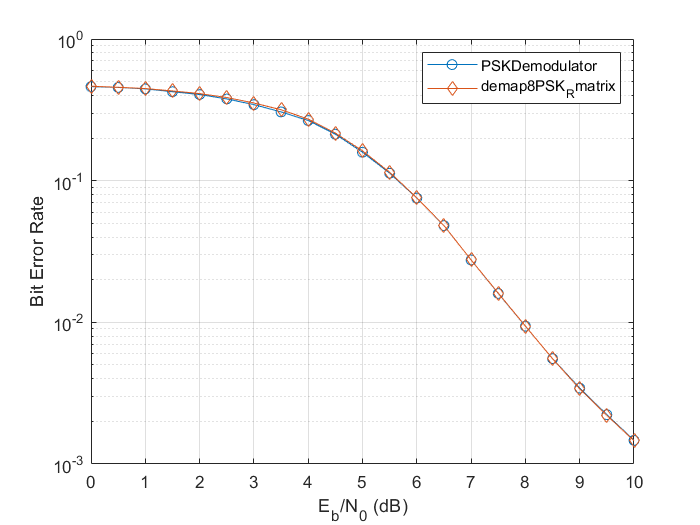

### Моделирование упрощённого мягкого фазового демодулятора в системе MATLAB

#### Файлы данного репозитория:

##### Основные файлы:

* [**demap8PSK_Rmatrix.m**](demap8PSK_Rmatrix.m) - основная функция демодулятора, которая вычисляет LLR для каждого бита полученного символа 8PSK, используя R-матрицу
* [**getRMatrix.m**](getRMatrix.m) - функция для расчёта R-матриц
* [**determineRegion.m**](determineRegion.m) - функция для определения области фазового угла сигнала

##### Вспомогательные файлы для проведения тестов:

* [**printRMatrixValues.m**](printRMatrixValues.m) - файл для проверки работоспособности функции getRMatrix.m
* [**test_file.m**](test_file.m) - файл с набором тестов для файлов, представленных выше

##### Моделирование:

Для оценки работоспособности реализованного алгоритма мягкого фазового демодулятора для 8PSK, основанного на методе R-матриц, было проведено моделирование и сравнение с существующим демодулятором comm.PSKDemodulator из библиотеки MATLAB.

* [**comm_app.m**](comm_app.m) - измененный пример из документации [comm.APPDecoder](https://www.mathworks.com/help/comm/ref/comm.appdecoder-system-object.html) и [comm.PSKDemodulator](https://www.mathworks.com/help/comm/ref/comm.pskdemodulator-system-object.html) из MatLab (добавлено использование собственного демодулятора)
* [**comm_app_01.m**](comm_app_01.m) - измененный пример из документации [comm.APPDecoder](https://www.mathworks.com/help/comm/ref/comm.appdecoder-system-object.html) и [comm.PSKDemodulator](https://www.mathworks.com/help/comm/ref/comm.pskdemodulator-system-object.html) из MatLab, в данный файл добавлены также вышеперечисленные функции из *основных файлов*, чтобы он мог работать самостоятельно

#### Немного теории:

LLR, или логарифмическое отношение правдоподобия (Log-Likelihood Ratio), является ключевым показателем в демодуляции и декодировании цифровых сигналов, особенно в системах с мягким принятием решений. LLR предоставляет меру того, насколько вероятно, что определённый бит равен 1, а не 0, на основе принятого сигнала и шума в канале.

#### Результат моделирования:

